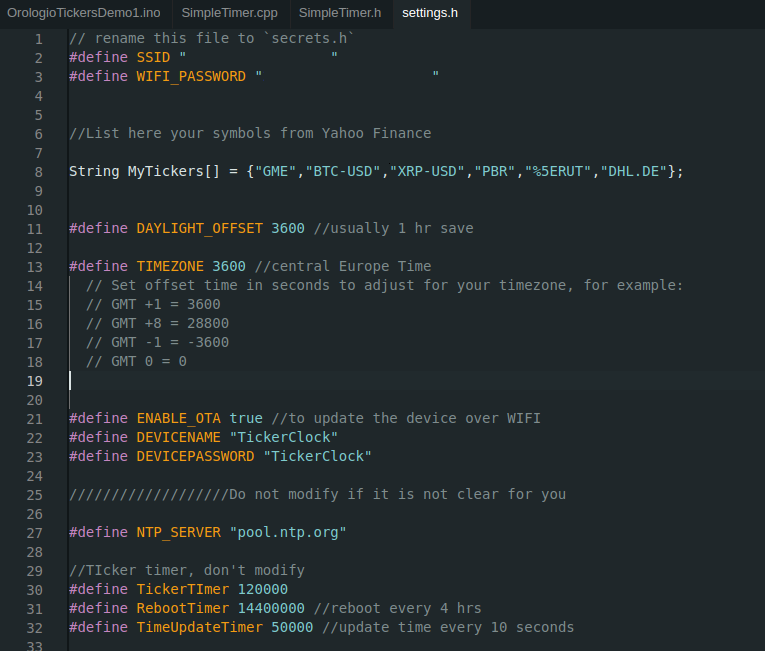

# Getting Started

The system is based on Arduino and runs over standard ESP32 boards. Here you can find the main steps needed to start deploying TickerWatch.

## Install Arduino and Libraries on your system

1. Install arduino in your system, use Arduino IDE 2.0: [Arduino Official Website](https://www.arduino.cc/en/Guide).
2. Install ESP32 in you arduino IDE installation, there are many guides online. [RandomNerdTutorials Guide is the best](https://randomnerdtutorials.com/installing-the-esp32-board-in-arduino-ide-windows-instructions/).
3. Install the needed libraries: 
    - [Arduino Json](https://arduinojson.org/v6/doc/installation/)
    - [Arduino Http Cliient](https://docs.arduino.cc/libraries/httpclient/)

## Configure your system

Download the [Basic Project](https://github.com/PlasticSkunkWorks/TraderWatch/archive/refs/heads/main.zip). from github, unzip the folder and open the .ino file with Arduino IDE. The system can be set using the settings.h file as shown in the picture:

Here there are the list of settings you have to enter:
- SSID and PASSWORD of your WIFI network
- The list of the tickers taken from Yahoo Finance
- Your timezone
- Do you need OTA updates? Set the variable yes or true. 